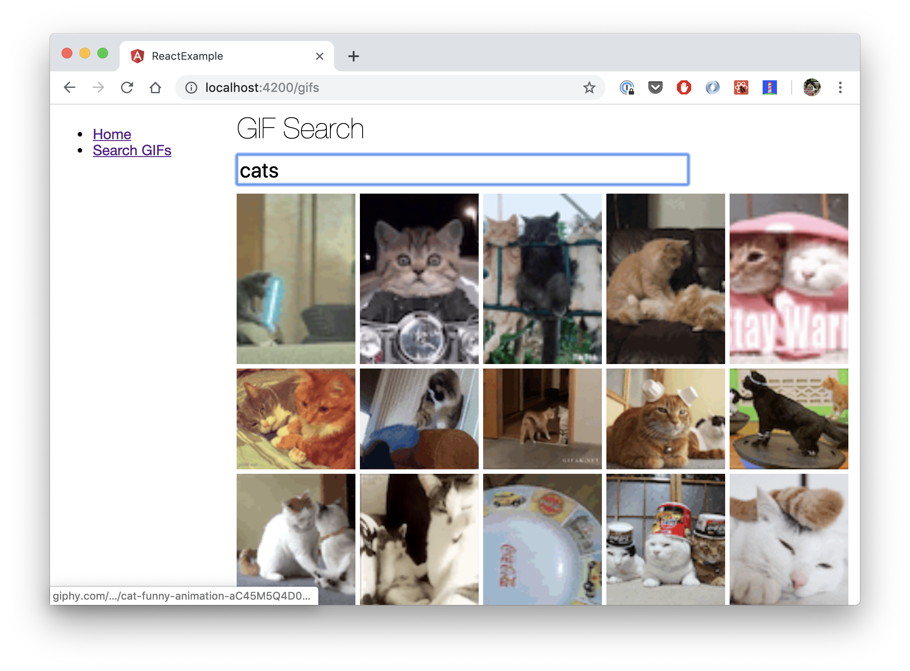

# Power-Up React Development Using Nx

React is a popular JavaScript framework for building user interfaces. It is easy to get started with React by using the official [Create React App](https://github.com/facebook/create-react-app), which will setup a working
 project for you with zero configuration.
 
 This is a great way to be introduced to the library since developers can get a running app up quickly. However, since React is *unopinionated*, developers will have to pick and choose their own patterns, tools, and libraries that best solve their problems.
 
 This flexibility to pick and choose is great when you want to craft your project just the way you want to. The downside is that React itself will not be able to provide much help to you beyond the initial project creation.

In this post we'll show how using Nx can really benefit the development workflow for React applications. We will cover:

* Creating a monorepo workspace for React apps and libraries.
* (Opinionated) Project structure.
* Useful Nx commands.
* Enforcing patterns using schematics.
* Leveling up productivity in a monorepo workspace.

## What is Nx? And Is That Angular CLI?

[**Nx**](https://nx.dev) is a tool maintained by us at [Nrwl](https://nrwl.io) that helps manage workspaces in a "monorepo" way. It extends the Angular CLI to provide useful tools that make full-stack development much easier.

We are leveraging the Angular CLI for its powerful abstractions over code generation (schematics), and command handling for building, serving, testing, etc. (builders). However, even though we are using the Angular CLI, **we will be building our application using React only**.

## Getting Started

Let's create a new React workspace using one of the following three methods.

**npx**

```bash
npx create-nx-workspace react-example
```

**npm**

```bash
npm init nx-workspace react-example
```

**yarn**

```bash
yarn create nx-workspace react-example
```

(If you're not sure which one to use, use the **npx** version)

Make sure to choose the "react" framework when prompted. We'll also be using SCSS, and npm scope of "example" (which controls how we scope our own modules).


This command sets up the basic structure for our monorepo workspace inside the newly created `react-example` folder.

```
apps/
  react-example/
  react-example-e2e/
libs/
angular.json
jest.config.js
package.json
nx.json
tsconfig.json
tslint.json
yarn.lock
```

You can run the app right away using `yarn ng serve react-example` and opening [http://localhost:4200](http://localhost:4200).

Of course, you're probably wondering what all these files and folders are for, so let's go over them now!

#### `apps` and `libs`

Inside the workspace we have *projects* that are categorized into two groups:

* Application (`apps`) - A composition of *libraries* that can run in the browser or server.
* Library (`libs`) - A group of functionality with a well-defined API. A library can depend on other libraries, and cannot run on their own.

Think of projects as modules that are distinct but may have dependencies on each other.

**Note:** The initial workspace has two apps by default: `apps/react-example` and `apps/react-example-e2e`. The former project is what we serve to end users, and the E2E project is what we will use to perform *end-to-end* testing on the app. 

#### `angular.json`

This file contains the metadata for each project within the workspace. Even though it is called "angular.json", it is framework-agnostic when it comes to the projects it builds. In our case, we are using the CLI to run a React app. 

#### `nx.json`

In addition to `angular.json`, the `nx.json` file further annotates to our projects. This can help us with enforcing architectural patterns such as what types of projects can depend on each other (e.g. UI libraries should not import application projects).

#### And the rest...

The other files are likely already be familiar to you.

* `jest.config.js` - Configuration for Jest test runner.
* `tsconfig.json` - TypeScript Configuration.
* `tslint.json` - Lint configuration for TypeScript files.
* `package.json` and `yarn.lock` - Node module dependencies for our projects.

**Note:** We generate `yarn.lock` by default, but if you are using `npm` instead of `yarn`, then feel free to delete this file. 

And that covers the structure. Next, let's see what we can do with Nx out of the box.

### Development Commands

We already covered how to serve the app: `ng serve react-example`.

Here are other useful commands for you.

- `yarn ng lint react-example` - Lints our application using our *tslint.json* config.
- `yarn ng test react-example` - Runs unit tests using Jest.
- `yarn ng e2e react-example-e2e` - Runs E2E tests using Cypress.

**Note:** You can leave out the project name from the command to run lint, test, e2e on all projects in the workspace. For example, `yarn ng lint` will lint all projects.

**Note #2:** The targets (`lint`, `test`, `e2e`) are configured in `angular.json` under the `architect` section of each project. Each target is mapped to a builder, which performs the actual work for the given target.

## Adding a New Feature

Let's make our app do something interesting, shall we?

### Generating a Feature Library

Apps are composed of many features, so it's a good idea to group them into separate libraries that will be imported by the main app.

We'll start by adding a **Home** feature that provides some introductory text for our application.

```bash
yarn ng generate lib \
--name=home \
--framework=none \
--no-interactive \
--dry-run
```

Here, I'm using the the `--dry-run` flag to **preview changes** before actually performing them in the workspace.

I should see something like this.


Everything looks good, so let's run the same command without `--dry-run`.

```bash
yarn ng generate lib --name=home --framework=none --no-interactive
```

**Note:** The **dry run** feature of the CLI is useful if you want to verify that the changes are *as intended*. This previewing is made possible because schematics in CLI do not operate on the real filesystem. Rather, they describe what transformations should applied to a virtual representation of the filesystem.

Next, we also need to update the generated `libs/gifs/tsconfig.json` to allow for React's JSX syntax by adding `"jsx": "react"` to `compilerOptions` , and including `"**/*.tsx"` files.

```json
{
  "extends": "../../tsconfig.json",
  "compilerOptions": {
    "jsx": "react",
    "types": ["node", "jest"]
  },
  "include": ["**/*.ts"]
}
```

Now let's add our `Home` component by adding the following file.

**libs/home/src/lib/home/home.tsx**

```typescript
import * as React from 'react';

export const Home = () => (
  <React.Fragment>
    <h1>Home</h1>
    <p>Welcome to the React Example app!</p>
    <p>Please see the sidenav for available features.</p>
  </React.Fragment>
);
```

We'll also need to update the exports of our index file.

**libs/home/src/index.ts**

```typescript
export * from './lib/home/home';
```

And finally, let's add our feature route to the application.

### Adding Routes to the Application

Let's use [React Router](https://reacttraining.com/react-router/) to handle the routing in our application.

**yarn**

```bash
yarn add react-router react-router-dom
```
Or **npm**

```bash
npm install react-router react-router-dom
```

Next, we'll update our app component to the following.

**apps/react-example/src/app/app.tsx**

```typescript
import * as React from 'react';
import { BrowserRouter, Route, Link } from 'react-router-dom';
import './app.scss';
import { Home } from '@example/home';

export const App = () => (
  <BrowserRouter>
    <div className="app">
      <nav className="app-nav">
        <ul>
          <li>
            <Link to="/">Home</Link>
          </li>
        </ul>
      </nav>
      <div className="app-content">
        <Route path="/" exact component={Home} />
      </div>
    </div>
  </BrowserRouter>
);
```

Now, serve the application again `yarn ng serve react-example` and you should see the following.


### Feature #2: GIF Search

Let's add one more feature. Say we want to allow users to search against the [Giphy API](https://developers.giphy.com/).

```bash
yarn ng generate lib --name=gifs --framework=none --no-interactive
```

Again, let's update add our component and update the index file.

**libs/gifs/src/lib/gifs/gifs.tsx**

```typescript
import * as React from 'react';
import './gifs.scss';

interface GifsProps {
  apiKey: string;
}

export const Gifs = (props: GifsProps) => {
  const [gifs, setGifs] = React.useState([]);
  const [text, setText] = React.useState('');

  React.useEffect(
    () => {
      fetch(
        `https://api.giphy.com/v1/gifs/search?api_key=${props.apiKey}&q=${text}`
      )
        .then(r => r.json())
        .then(json => {
          setGifs(
            json.data.map(x => ({
              id: x.id,
              preview: x.images.preview_gif,
              url: x.url
            }))
          );
        });
    },
    [text]
  );

  return (
    <React.Fragment>
      <h1>GIF Search</h1>
      <input
        className="gif-search-input"
        autoFocus
        placeholder="Start typing..."
        onChange={evt => setText(evt.target.value)}
      />
      <div className="gif-list">
        {gifs.map(gif => (
          <div className="gif-list-item" key={gif.id}>
            <a href={gif.url} target="_blank" rel="noopener">
              
            </a>
          </div>
        ))}
      </div>
    </React.Fragment>
  );
};
```

**libs/gifs/src/lib/gifs/gifs.scss**

```scss
.gif-search-input {
  width: 500px;
  display: block;
  font-size: 24px;
  margin: 10px 0;
}

.gif-list {
  display: grid;
  grid-template-columns: repeat(5, calc(20% - 5px));
  grid-gap: 5px;
}

.gif-list-item {
  width: 100%;
  a,
  img {
    display: block;
    width: 100%;
    height: 100%;
    object-fit: cover;
  }
}
```

**libs/gifs/src/index.ts**

```typescript
export * from './lib/home/home';
```

And to use the `Gifs` component from our app, let's update `apps/react-example/src/app/app.tsx` to the following.

```typescript
import * as React from 'react';
import { BrowserRouter, Route, Link } from 'react-router-dom';
import { Home } from '@example/home';
import { Gifs } from '@example/gifs';

// Bring in the environment file that holds our giphy API key.
// This file is replaced with `environment.prod.ts` automatically when building for production.
import { environment } from '../environments/environment';

export const App = () => (
  <BrowserRouter>
    <div className="app">
      <nav className="app-nav">
        <ul>
          <li>
            <Link to="/">Home</Link>
          </li>
          <li>
            <Link to="/gifs">Search GIFs</Link>
          </li>
        </ul>
      </nav>
      <div className="app-content">
        <Route path="/" exact component={Home} />
        <Route
          path="/gifs"
          render={() => <Gifs apiKey={environment.giphy.apiKey} />}
        />
      </div>
    </div>
  </BrowserRouter>
);
```

Then, in our `apps/react-example/src/environments/environment.ts` file, let's add the giphy entry.

```typescript
export const environment = {
  production: false,
  giphy: {
    apiKey: 'dc6zaTOxFJmzC'
  }
};
```

Now, if we serve the application again, we should see the following.



To use the application in production, we can run the following command.

```bash
ng build react-example --configuration=production
```

This will generate assets under `dist/apps/react-example` that can then be served statically.

To recap, so far we've seen how to:

* Generate a new React monorepo workspace with one application.
* Add new feature libraries and route to them from our application.

## Schematics: Codifying Library and Component Generation

You may have noticed how tedious is it to add a new feature and component. This is because after we generate the library, we have to:

* Update `tsconfig.json` and `tsconfig.spec.json` to set `jsx` and `include` options.
* Add component `.tsx` and `.scss` files.
* Update `index.ts` file of the library.

What if we can codify all these steps to run automatically?

This is where Nx's workspace schematics come in. They can be generated using the `yarn ng generate workspace-schematic [name]` command.

For example, to create **react-lib** and **react-component** schematics we'd run:

```bash
yarn ng generate workspace-schematic react-lib
yarn ng generate workspace-schematic react-component
```

For our previous GIFs example, we could have run the following using the schematics to bootstrap everything.

```bash
yarn workspace-schematic react-lib --name=gifs
yarn workspace-schematic react-component --name=Gifs --project=gifs
```

I'm not going to go over the schematics in this post since they are out of scope. However, here's a quick look at the react-component schematic.

```typescript

export default function(opts: any): Rule {
  return (host: Tree) => { // <-- The Tree here represents the filesystem
    // We can read files off of the Tree
    const angularJson = JSON.parse(host.read('angular.json').toString());
    const project = angularJson.projects[opts.project];
    const src = project.sourceRoot;
    const fileName = strings.dasherize(opts.name);
    const componentName = strings.classify(opts.name);
    const indexFile = host.read(`${src}/index.ts`);
    
    // We can also overwrite files in the Tree
    host.overwrite(
      `${src}/index.ts`,
      `${indexFile.toString()}\nexport * from './lib/${fileName}/${fileName}';`
    );

    // Angular devkit comes with helper functions to perform common operations on the Tree 
    const templateSource = apply(url('./files'), [
      template({
        tmpl: '',
        fileName,
        componentName
      }),
      move(`${src}/lib/${fileName}`)
    ]);
    return mergeWith(templateSource);
  };
}
```

For the full implementation, please refer to the [git repo](https://github.com/nrwl/react-nx-example/tree/master/tools).

## Testing and Building Only Affected Code

One of the challenges in working with a larger codebase is knowing what's been affected from a given changeset.

The naive approach to testing software is to retest and rebuild *everything* whenever *anything* changes in the workspace. But we can do better!

### Adding UI Library and Testing Affected changes.

Let's add the new UI library along with a `Header` component.

```bash
yarn workspace-schematic react-lib --name=ui
yarn workspace-schematic react-component --name=Header --project=ui
```


We can then replace usages of `<h1>` with our new `Header` in the `Home` component.

e.g.

```typescript
// home.tsx
import { Header } from '@example/ui'
export const Home = () => (
  <React.Fragment>
    <Header>Home</Header>
    <p>Welcome to the React Example app!</p>
    <p>Please see the sidenav for available features.</p>
  </React.Fragment>
);
```

Now, we can check which applications and libraries are affected by this change by running:

```bash
yarn affected:dep-graph --base=master
```

Which should generate the following graph. (Rectangles are apps, ovals are libs)


In this case, since we modified `angular.json` and `nx.json` by generate a new library, everything needs to be retested just in case a configuration change causes an error.

Since we're happy with our changes, let's commit the code to `master`.

```bash
git commit -am "Adds Header component"
```

**Note:** We are using `--base=master`, which will compare our current changes with the `HEAD` of `master` branch. This is usually what you want to use.

#### Retesting Only UI Library Changes

Say that we want to add a new `TextInput` component to our `ui` library.

```bash
yarn workspace-schematic react-component --name=TextInput --project=ui
```

Now, if we regenerate the affected graph, you'll see that only the `home` and `react-example` projects are affected.


This is because we never used the `ui` library in our `gifs` feature, thus it is not on the affected path.

We can now retest only the parts of our code that needs to be checked.

```bash
yarn affected:test --base=master
```

There are several other affected commands, such as `affected:build`, `affected:lint`, etc. These commands are critical in ensuring that our development and continuous environment workflow remain *optimized* even as the workspace grows. 

For more information on affected commands, please refer to [our guide](https://nx.dev/guides/monorepo-affected).

## Bonus: UI Frontend for CLI and Nx

The commands I've shown in this post require you to remember the options available for each schematic and builder. I find it much easier to use the CLI through an UI that can present these options to you in an easy-to-digest format.

This is why we've built a frontend for the CLI, the [Angular Console](https://angularconsole.com/).


Again, the "Angular" in the name refers to it being a frontend to the CLI, not that you necessarily have to build your application *in* Angular.
 
## In Closing

In this post I showed you how to **create a new React workspace** using **Nx**. Then, we codified our library and component generation by using **workspace schematics**. Lastly, we saw how the **affected commands** can help our workspace remain optimized even as it continues to grow in size.

Please check out the [working repo](https://github.com/nrwl/react-nx-example) if you want to play around with the examples in this post yourself.

The material covered in this post scratches only the surface of what Nx provides. If you're interested in learning more, please head over to [our docs](https://nx.dev/)!

Next steps for the workspace may include:

* Bringing **other apps** into the workspace so they can easily share libraries (and be retested when needed).
* Creating a workspace schematic to generate a **Redux modules** (generate actions, reducers, etc.).
* Updating the component schematic to use a **CSS-in-JS** solution such as [styled-components](https://www.styled-components.com) or [emotion](https://emotion.sh).
* Extend the built-in **webpack config** by providing `webpackConfig` option for `@nrwl/builders:web-build` and `@nrwl/builders:web-dev-server"` builders in `angular.json`.
* ...

I hope you find this post useful, and I'd love to hear some feedback if you decide to check out Nx!
